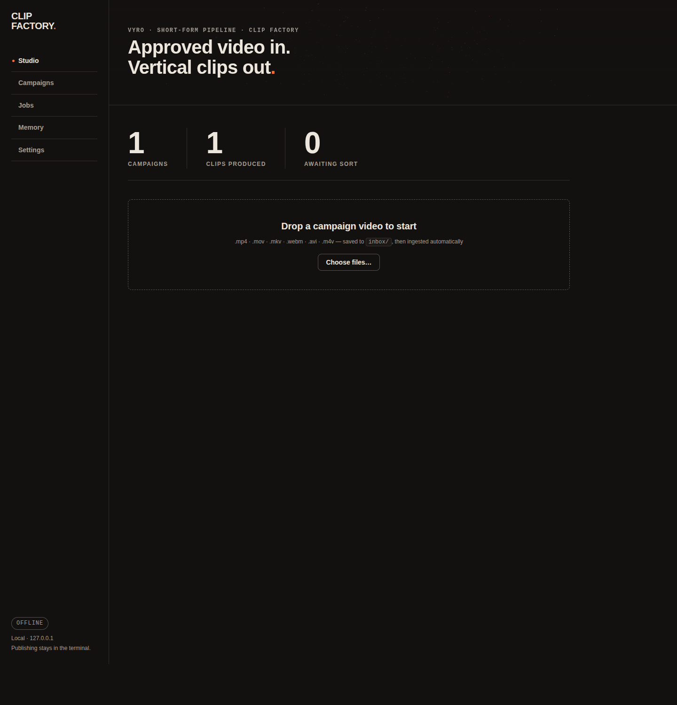
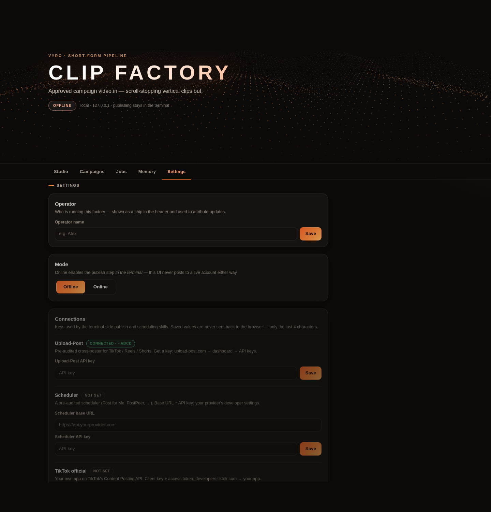

<div align="center">

```
 ██████ ██      ██ ██████     ███████  █████   ██████ ████████  ██████  ██████  ██    ██
██      ██      ██ ██   ██    ██      ██   ██ ██         ██    ██    ██ ██   ██  ██  ██
██      ██      ██ ██████     █████   ███████ ██         ██    ██    ██ ██████    ████
██      ██      ██ ██         ██      ██   ██ ██         ██    ██    ██ ██   ██    ██
 ██████ ███████ ██ ██         ██      ██   ██  ██████    ██     ██████  ██   ██    ██
```

**Approved campaign footage in → scroll-stopping vertical clips out.**

A local, AI-operated clipping factory for the Vyro platform — TikTok / Reels / Shorts.


</div>

## What it does

Drop campaign videos in — get finished 9:16 clips out: auto-sorted into named
campaigns, reframed with punch-in, **word-synced animated captions** with brand-color
highlights, color grade, retention progress bar, loudness normalization, plus drafted
titles, captions, pinned comments, and hashtags (4 max) checked against the campaign's
banned phrases. A compliance gate blocks anything that breaks the brief, and nothing
ever posts without a human confirming in the terminal.

## Two ways to drive it

**The web dashboard** — `./clip ui` (drag & drop, auto-sort, one-click produce, settings):



**The terminal** — `./clip` (big-art menu, spinners, live render progress), or hand the
folder to **any AI agent** (Claude Code / Codex / Gemini): `AGENTS.md` + the shared
git-native memory (`./clip mem`) mean every agent picks up exactly where the last stopped.

## Quick start

```bash
./install.sh     # one command: system deps + venv + extras + health check
./clip demo      # safe end-to-end tour on synthetic footage
./clip ui        # → http://127.0.0.1:8787
```

## The pipeline

| Stage | Command | What happens |
|-------|---------|--------------|
| Ingest | `./clip ingest` | probe, transcribe, stage — idempotent |
| Sort | `./clip sort auto` | auto-named campaigns from filenames + transcripts |
| Select | `./clip select` | rank the strongest moments (audio energy, scenes, silence) |
| Cut | `./clip cut` | frame-accurate trim |
| Produce | `./clip produce` | 9:16 + captions + grade + hook + progress bar |
| QA | `./clip sheet` | contact sheet — the hook must match the footage |
| Content | `./clip content` | titles, captions, pinned comment, hashtags, cover prompt |
| Publish | `./clip publish` | compliance gate → dry-run → human-confirmed post |

Settings, publish-backend keys, and the operator profile live in the dashboard's
**Settings** tab (secrets never leave the machine — the browser only ever sees the
last 4 characters):



## For AI operators

Start at **`AGENT-PLAYBOOK.md`**. Memory: `./clip mem recall` (auto via Claude Code
hook). Switching AIs: `./clip handoff`. The rules that protect the account are in
**`AGENTS.md`** — approved source only, disclose AI, never post unattended.

## Verified

`bash tests/smoke.sh` runs the whole pipeline on synthetic footage — 23 checks,
run by CI on every PR. Zero runtime dependencies beyond ffmpeg + Python stdlib
(whisper & pillow optional).
